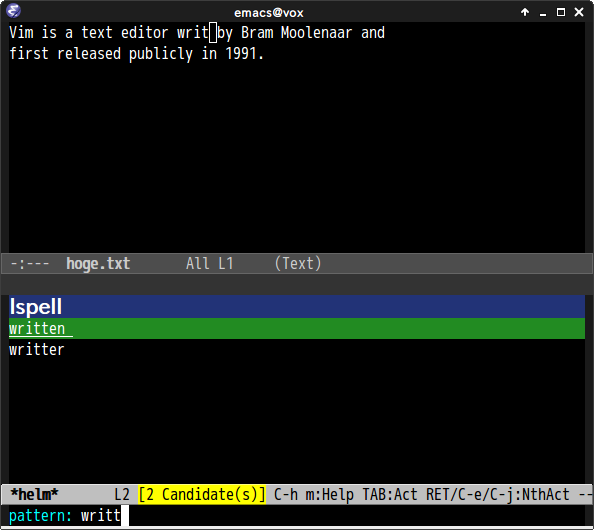

# helm-ispell.el

## Introduction

`helm-ispell.el` provides ispell completion with helm interface.

## Screenshot

## Requirements

- Emacs 24 or higher
- [helm](https://github.com/emacs-helm/helm)
- ispell/aspell

## Commands

#### `helm-ispell`

Insert dictionary word with helm interface
